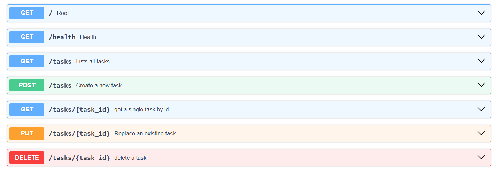
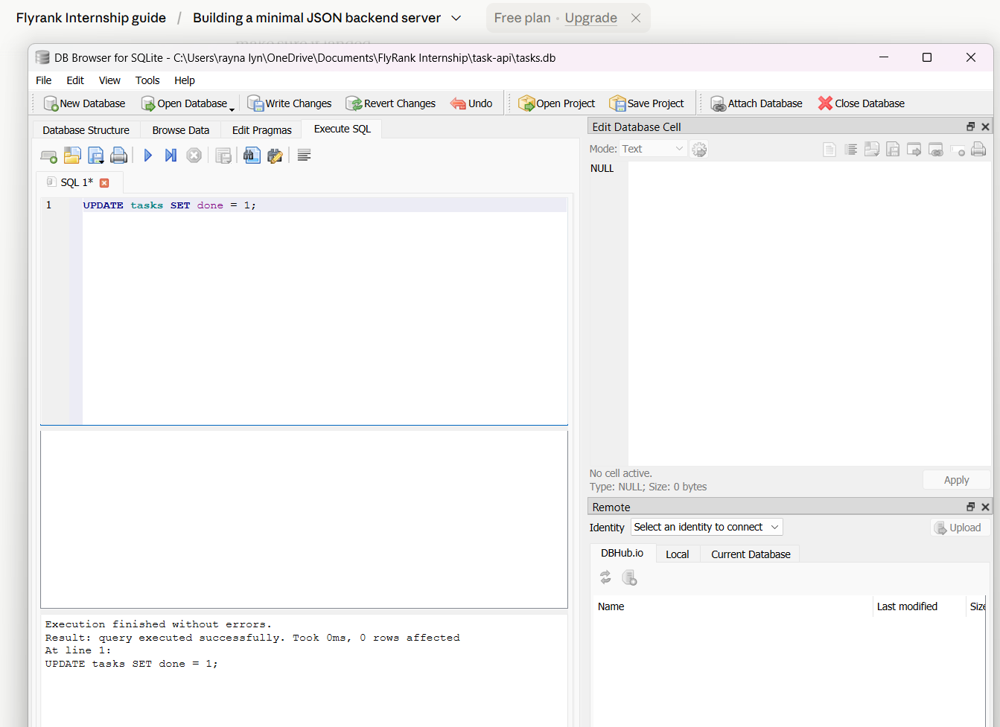

```markdown
# Task API

A CRUD API for managing a to-do list, built with FastAPI and backed by a SQLite database. Data persists across server restarts.

## Why SQLite

SQLite was chosen because it requires no separate database server — the entire database lives in a single file (`tasks.db`) that's created automatically the first time the app runs. This makes it ideal for learning and small projects: zero setup, zero configuration, and easy to inspect directly with a tool like DB Browser for SQLite.

## Database

- **File:** `tasks.db`, created automatically in the project root on first run
- **Table:** `tasks` (`id` autoincrementing primary key, `title` text, `done` boolean)
- Three example tasks are seeded automatically the first time the table is empty
- Data survives server restarts — only wiped if `tasks.db` is deleted manually

## Setup & Run

1. Clone this repo
2. Create and activate a virtual environment:
   ```
   python -m venv venv
   source venv/Scripts/activate   # Windows Git Bash
   source venv/bin/activate       # Mac/Linux
   ```
3. Install dependencies:
   ```
   pip install fastapi uvicorn
   ```
4. Run the server:
   ```
   uvicorn main:app --reload --port 8000
   ```
5. Visit `http://127.0.0.1:8000/docs` for interactive API docs.

The database file (`tasks.db`) and table are created automatically on first run — no manual setup needed.

## Endpoints

| Method | Path            | Description                | Success Code | Error Codes |
|--------|-----------------|-----------------------------|---------------|-------------|
| GET    | `/`             | API info                    | 200           | —           |
| GET    | `/health`       | Health check                 | 200           | —           |
| GET    | `/tasks`        | List all tasks               | 200           | —           |
| GET    | `/tasks/{id}`   | Get a single task by id      | 200           | 404         |
| POST   | `/tasks`        | Create a new task            | 201           | 400, 422    |
| PUT    | `/tasks/{id}`   | Replace an existing task     | 200           | 400, 404    |
| DELETE | `/tasks/{id}`   | Delete a task                | 204           | 404         |

## Example Request

```
curl -i -X POST http://127.0.0.1:8000/tasks -H "Content-Type: application/json" -d '{"title":"Buy milk"}'

HTTP/1.1 201 Created
content-type: application/json

{"id":4,"title":"Buy milk","done":false}
```

## Swagger UI



## Database Viewer

Opened with DB Browser for SQLite to inspect and manually query the data:



Example query run manually:
```sql
SELECT * FROM tasks WHERE done = 1;
```

## Notes

Earlier versions of this API stored tasks in memory (a Python list), meaning all data was lost on restart. This version replaces that with a real SQLite database — the API's endpoints, request/response shapes, and status codes are unchanged; only the storage layer is different. This is the core lesson of this stage: APIs describe *what* an application does, databases describe *where* it stores its data.
```

**To finish:**
1. Save your DB Browser screenshot as `db-browser-screenshot.png` in your `task-api` folder
2. Replace the README's SQL example if you want to show the exact one you ran
3. Commit:
```bash
git add README.md db-browser-screenshot.png
git commit -m "Stage 5: database documentation"
git push
```

```markdown
# Task API

A CRUD API for managing a to-do list, built with FastAPI. Now fully containerized: the app and a Postgres database run together via Docker Compose, with data persisting across restarts.

## Architecture

- **`main.py`** — FastAPI routes only (HTTP concerns: status codes, validation, request/response shapes)
- **`db.py`** — Postgres repository layer (all SQL lives here)
- **`init.sql`** — creates the `tasks` table and seeds 3 example tasks on first run
- **`Dockerfile`** — builds the FastAPI app into its own container
- **`docker-compose.yml`** — runs the app and Postgres together as one stack

The routes and service logic did **not change** when storage moved from an in-memory list → SQLite → Postgres. Only `db.py` (the repository) changed. This is the core architectural point of this stage: the API layer doesn't know or care how data is stored.

## Setup & Run

1. Clone this repo
2. Copy `.env.example` to `.env` and fill in real values:
   ```
   cp .env.example .env
   ```
   Default values matching `docker-compose.yml`:
   ```
   DATABASE_URL=postgresql://taskuser:taskpass@db:5432/taskdb
   ```
3. Start the whole stack (app + database) with one command:
   ```
   docker compose up --build
   ```
4. Visit `http://127.0.0.1:8000/docs` for interactive API docs.

No manual database setup needed — `init.sql` runs automatically the first time the `db` container starts, creating the `tasks` table and seeding 3 example tasks.

## Endpoints

| Method | Path            | Description                | Success Code | Error Codes |
|--------|-----------------|-----------------------------|---------------|-------------|
| GET    | `/`             | API info                    | 200           | —           |
| GET    | `/health`       | Health check                 | 200           | —           |
| GET    | `/tasks`        | List all tasks               | 200           | —           |
| GET    | `/tasks/{id}`   | Get a single task by id      | 200           | 404         |
| POST   | `/tasks`        | Create a new task            | 201           | 400, 422    |
| PUT    | `/tasks/{id}`   | Replace an existing task     | 200           | 400, 404    |
| DELETE | `/tasks/{id}`   | Delete a task                | 204           | 404         |

## Example Request

```
curl -i -X POST http://127.0.0.1:8000/tasks -H "Content-Type: application/json" -d '{"title":"Buy milk"}'

HTTP/1.1 201 Created
content-type: application/json

{"id":4,"title":"Buy milk","done":false}
```

## Proving Persistence

To confirm data survives a full restart of both the app and the database container:

1. Created a task via `POST /tasks`
2. Ran `docker compose down` (removes containers) — confirmed with `docker ps` that nothing was running
3. Ran `docker compose up --build -d` (fresh containers, new container IDs)
4. Ran `GET /tasks` again — the task created in step 1 was still present

This works because Postgres's data directory is mounted to a named Docker volume (`pgdata`), which is **not** deleted by `docker compose down`. Only `docker compose down -v` (or manually removing the volume) would erase it.

## A real gotcha I hit

Docker Compose automatically prefixes volume names with the project folder name by default (e.g. `pgdata` becomes `task-api_pgdata`). This meant an early manually-created volume (`pgdata`, made via a standalone `docker run` command before Compose was set up) was a **different volume** than the one Compose was using — so data created through Compose didn't appear to persist correctly at first. Fixed by explicitly pinning the volume name in `docker-compose.yml`:
```yaml
volumes:
  pgdata:
    name: pgdata
```

## Swagger UI


## Notes

Earlier versions of this API used an in-memory list, then SQLite. This version uses Postgres running in Docker, orchestrated with Docker Compose. Secrets (database credentials) are kept in a gitignored `.env` file; `.env.example` documents the required format without exposing real values.
```
